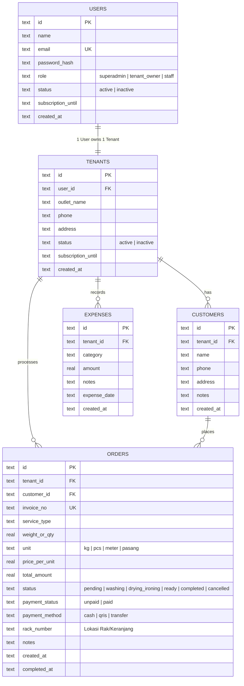

# Product Requirements Document (PRD)
# Orchid Brand Smart Laundry (Sistem Manajemen Laundry Multi-Tenant)

- **Versi Dokumen:** 1.0.0
- **Status:** Active / In-Development
- **Tech Stack:** Bun, Hono.js, Drizzle ORM, PostgreSQL, React 18, Vite, Tailwind CSS, Docker

---

## 1. Executive Summary & Visi Produk

**Orchid Brand Smart Laundry** adalah platform Multi-Tenant SaaS berbasis cloud untuk manajemen operasional dan keuangan bisnis laundry modern. Aplikasi ini dirancang untuk:
1. Memberikan kemudahan bagi **Superadmin Pusat** dalam memantau cabang/tenants di berbagai kota (Prinsip: 1 User = 1 Tenant Outlet).
2. Membantu **Pemilik Laundry (Tenant Owner) & Kasir** mencatat arus kas nyata secara online real-time:
   - **Uang Masuk (Income):** bersumber langsung dari transaksi order laundry (tunai, transfer, QRIS).
   - **Uang Keluar (Expenses):** pencatatan pengeluaran operasional (deterjen, pewangi, listrik, air, gaji, servis mesin, dsb).
3. Meningkatkan kepuasan pelanggan melalui **Notifikasi Otomatis WhatsApp** saat cucian selesai diproses dan siap diambil.

---

## 2. Arsitektur Monorepo & Teknologi

```
orchidbrand-smart-loundry/
├── .gitignore              # Monorepo ignore (node_modules, .env, dist)
├── package.json            # Root workspace config (`bun dev`)
├── docker-compose.yml      # Multi-container deployment (Postgres + Backend + Frontend)
├── PRD.md                  # Product Requirements Document
├── TODO.md                 # Roadmap & Status Pengerjaan
├── README.md               # Dokumentasi instalasi & panduan
├── backend/                # API Service (Bun + Hono + Drizzle ORM + PostgreSQL)
│   ├── src/
│   │   ├── index.ts        # Hono routing & business logic
│   │   └── db/
│   │       ├── index.ts    # Database client (PostgreSQL postgres-js)
│   │       ├── schema.ts   # Drizzle pg-core schema definition
│   │       └── seed.ts     # Initial demo data seeder
│   ├── Dockerfile
│   └── package.json
└── frontend/               # Single Page Application (React + Vite + Tailwind)
    ├── src/
    │   ├── App.tsx         # Dashboard Root Orchestrator
    │   ├── types/          # Shared TypeScript interfaces
    │   ├── components/     # Modular UI (Sidebar, Header, Tabs, Modals)
    │   └── main.tsx
    ├── Dockerfile
    └── package.json
```

### Stack Detail
| Layer | Komponen | Alasan Pemilihan |
|---|---|---|
| **Runtime & Package Manager** | Bun (v1.3+) | Eksekusi TypeScript native tanpa build step tambahan, startup instan (<10ms), konsumsi memori rendah. |
| **Backend Framework** | Hono.js (v4) | Framework web standar Web-Standards tercepat, tipe data aman (type-safe), native support Bun. |
| **ORM & Database** | Drizzle ORM + PostgreSQL (`postgres-js`) | Standar industri untuk SaaS Multi-Tenant Cloud. Handal menangani konkurensi multi-user, transaksi ACID, dan kompatibel dengan cloud hosting (Supabase, Neon, AWS RDS). |
| **Frontend Framework** | React 18 + Vite | Standar industri, reload super cepat, rendering interaktif. |
| **Styling & UI** | Tailwind CSS + Lucide Icons | Desain responsif, clean aesthetic, siap pakai untuk tampilan dashboard modern. |
| **Containerization** | Docker + Docker Compose | Standarisasi deployment production multi-platform (Linux/Windows/macOS). |

---

## 3. User Personas & Role

1. **Superadmin / Franchise Owner (Orchid Brand HQ)**
   - Memantau seluruh cabang tenant laundry yang terdaftar.
   - Melihat total omset agregat dan performa tiap tenant.
   - Menambahkan outlet dan user owner baru.

2. **Tenant Owner / Kasir Outlet**
   - Melakukan input pesanan laundry baru (Kg / Satuan).
   - Memperbarui status pengerjaan (Pending ➔ Cuci ➔ Kering/Setrika ➔ Siap Diambil ➔ Selesai).
   - Mengirim notifikasi WhatsApp otomatis ke nomor customer saat cucian siap.
   - Mencatat pengeluaran harian/mingguan toko (deterjen, plastik, listrik, air).
   - Melihat laporan laba/rugi bersih (Omset - Pengeluaran).

3. **Customer Laundry**
   - Menerima update status nota dan total tagihan via WhatsApp.

---

## 4. Fitur Utama & Kebutuhan Fungsional

### A. Manajemen Tenant & User (1 User : 1 Tenant)
- **FR-1.1:** Superadmin dapat melihat daftar seluruh tenant beserta owner, kontak, total order, dan total omset.
- **FR-1.2:** Superadmin dapat mendaftarkan tenant baru sekaligus akun login ownernya.
- **FR-1.3:** Setiap tenant memiliki data transaksi, customer, dan pengeluaran yang terisolasi secara logis (`tenantId`).
- **FR-1.4:** Pengaturan masa langganan tenant (*subscription date*) dan kontrol status akun (*active/inactive*).

### B. Order Laundry & Kasir Operasional
- **FR-2.1:** Pembuatan order baru dengan kalkulasi harga otomatis berdasarkan berat (Kg) atau kuantitas (Pcs).
- **FR-2.2:** Penomoran nota otomatis berbasis format unik `INV-YYYYMM-XXX`.
- **FR-2.3:** Pelacakan siklus 6 tahap status cucian:
  1. `pending` (Menunggu Diproses / Antrian)
  2. `washing` (Sedang Dicuci)
  3. `drying_ironing` (Pengeringan & Setrika)
  4. `ready` (Selesai & Siap Diambil)
  5. `completed` (Sudah Diambil Pelanggan)
  6. `cancelled` (Dibatalkan & dikecualikan dari omset aktif)
- **FR-2.4:** Manajemen status pembayaran: `unpaid` (Belum Lunas) vs `paid` (Lunas) dengan pilihan metode bayar (`cash`, `transfer`, `qris`).
- **FR-2.5 (Nomor Rak / Keranjang):** Pencatatan nomor rak/keranjang cucian (`rackNumber`) untuk mencegah tertukarnya pakaian antar tetangga di laundry perumahan.
- **FR-2.6 (Koreksi Pesanan Kasir):** Modal edit pesanan (`EditOrderModal`) untuk memperbarui berat, harga per unit, total biaya, layanan, nomor rak, status, dan catatan khusus.
- **FR-2.7 (Deteksi Cucian Menginap):** Deteksi otomatis pesanan berstatus `ready` yang belum diambil lebih dari 3 hari, dilengkapi badge peringatan dan filter cepat `⚠️ Menginap (>3 Hari)`.
- **FR-2.8 (Pelunasan Cepat Kasir):** Modal mini quick-pay untuk memilih metode pembayaran 1-klik (Tunai, QRIS, Transfer) langsung dari baris tabel pesanan.
- **FR-2.9 (Hapus Pesanan Permanen):** Opsi penghapusan pesanan permanen (`DELETE`) untuk transaksi yang dibatalkan atau salah entri.

### C. Cetak Struk Kasir Thermal & QR Code Nota
- **FR-3.1:** Pratinjau struk kasir thermal authentic (`ReceiptModal`) dengan pilihan ukuran kertas printer **58mm** (Bluetooth saku) dan **80mm** (Desktop POS).
- **FR-3.2:** Integrasi **QR Code Nota** dinamis langsung pada kertas struk berbasis invoice number.
- **FR-3.3:** Cetak langsung ke printer via browser (`window.print()`) dengan CSS print layout presisi tanpa margin kosong berlebih.
- **FR-3.4:** Tombol **Kirim ke WhatsApp** langsung dari modal struk untuk kemudahan kirim nota digital.

### D. Notifikasi WhatsApp Cerdas ke Pelanggan
- **FR-4.1:** Generator pesan WhatsApp kontekstual otomatis berbasis status pesanan:
  - *Pesanan Diterima:* Rincian layanan, estimasi biaya, dan status pembayaran.
  - *Siap Diambil:* Kabar gembira cucian selesai, lokasi rak penyimpanan, dan sisa tagihan.
  - *Pengingat Cucian Menginap:* Peringatan ramah jika cucian sudah lebih dari 3 hari tersimpan di rak toko.
  - *Selesai Diambil:* Ucapan terima kasih dan doa kepuasan.
  - *Dibatalkan:* Informasi pembatalan pesanan.
- **FR-4.2:** Normalisasi nomor telepon otomatis (format internasional `628xxx` dari input lokal `08xxx`).
- **FR-4.3:** Siap diintegrasikan dengan WhatsApp Gateway API (seperti Fonnte atau Wablas).

### E. Pencatatan Keuangan (Arus Kas Masuk, Keluar & Laporan)
- **FR-5.1 (Uang Masuk):** Agregasi otomatis dari seluruh order berstatus `paid` (mengabaikan pesanan yang dibatalkan).
- **FR-5.2 (Piutang):** Pelacakan akumulasi tagihan belum dibayar pelanggan (`unpaid`).
- **FR-5.3 (Uang Keluar):** Formulir pencatatan pengeluaran operasional (deterjen, pewangi, listrik, air PAM, gas, gaji karyawan, servis mesin).
- **FR-5.4 (Laba Bersih / Net Profit):** Perhitungan dinamis `Total Uang Masuk Lunas - Total Pengeluaran`.
- **FR-5.5 (Ekspor Laporan):** Unduh laporan keuangan format **CSV (UTF-8 BOM)** kompatibel Microsoft Excel dan cetak dokumen resmi format **PDF** dengan kop surat outlet.

### F. Manajemen Data Pelanggan (Customer Directory)
- **FR-6.1:** Direktori pelanggan terisolasi per tenant (Nama, Nomor WhatsApp, Alamat, Catatan Khusus).
- **FR-6.2:** Pendaftaran pelanggan baru instan (*Inline Customer Form*) langsung di dalam modal Order Baru tanpa perlu bolak-balik menu.
- **FR-6.3:** Riwayat transaksi per pelanggan dan tombol direct WhatsApp untuk kontak langsung.

---

## 5. Skema Basis Data (Data Model)



---

## 6. Spesifikasi REST API

| Endpoint | Method | Fungsi | Request Body / Query |
|---|---|---|---|
| `/api/health` | GET | Healthcheck backend & runtime Bun PostgreSQL | - |
| `/api/auth/login` | POST | Login pengguna & verifikasi lisensi langganan | `{ email, password }` |
| `/api/auth/logout` | POST | Logout & terminasi sesi pengguna | - |
| `/api/users` | GET | List seluruh pengguna sistem | - |
| `/api/users` | POST | Buat akun pengguna baru (Superadmin) | `{ name, email, password, role, tenantId, status }` |
| `/api/users/:id` | PUT | Perbarui profil & kata sandi pengguna | `{ name, email, password, role, status }` |
| `/api/users/:id/status`| PATCH | Toggle status aktif/nonaktif & masa langganan | `{ status, subscriptionUntil }` |
| `/api/users/:id` | DELETE | Hapus akun pengguna (kecuali superadmin utama) | - |
| `/api/tenants` | GET | List seluruh cabang tenant + metrics agregat | - |
| `/api/tenants` | POST | Pendaftaran tenant + owner baru | `{ ownerName, ownerEmail, password, outletName, phone, address }` |
| `/api/customers` | GET | List pelanggan per tenant | `?tenantId=...` |
| `/api/customers` | POST | Tambah data pelanggan | `{ tenantId, name, phone, address, notes }` |
| `/api/customers/:id` | PUT | Perbarui data pelanggan | `{ name, phone, address, notes }` |
| `/api/customers/:id` | DELETE | Hapus data pelanggan | - |
| `/api/orders` | GET | List order per tenant terurut terbaru | `?tenantId=...` |
| `/api/orders` | POST | Buat order baru (opsi inline new customer & no. rak) | `{ tenantId, customerId?, newCustomer?, serviceType, weightOrQty, unit, pricePerUnit, totalAmount, paymentStatus, paymentMethod, notes, rackNumber }` |
| `/api/orders/:id` | PUT | Edit data pesanan kasir (koreksi berat/harga/rak) | `{ customerId, serviceType, weightOrQty, unit, pricePerUnit, totalAmount, status, paymentStatus, paymentMethod, notes, rackNumber }` |
| `/api/orders/:id/status`| PATCH | Ubah status pengerjaan & payload WhatsApp | `{ status: "ready" \| "completed" \| "cancelled" ... }` |
| `/api/orders/:id/payment`| PATCH | Update status bayar & metode pembayaran | `{ paymentStatus: "paid" \| "unpaid", paymentMethod: "cash" \| "qris" \| "transfer" }` |
| `/api/orders/:id` | DELETE | Hapus data pesanan secara permanen | - |
| `/api/expenses` | GET | List pengeluaran operasional per tenant | `?tenantId=...` |
| `/api/expenses` | POST | Input pengeluaran baru | `{ tenantId, category, amount, notes, expenseDate }` |
| `/api/expenses/:id` | DELETE | Hapus catatan pengeluaran kas | - |
| `/api/stats/cashflow`| GET | Statistik laba rugi & ringkasan status cucian | `?tenantId=...` |

---

## 7. Kebutuhan Non-Fungsional (NFR)

1. **Kecepatan & Latensi Tinggi:**
   - Respon REST API backend Bun + Hono rata-rata < 20ms untuk operasi CRUD lokal.
   - Hot-reload Vite dev server < 100ms untuk pengalaman pengembangan instan.
2. **Kemudahan Menjalankan:**
   - Cukup satu perintah `bun dev` dari direktori root untuk menjalankan fullstack (Backend di port 5000 & Frontend di port 5173).
   - Dukungan satu perintah `docker compose up --build -d` untuk menjalankan seluruh stack produksi (PostgreSQL container, Hono backend container, dan Nginx Vite frontend container).
3. **Persistensi & Keandalan Basis Data:**
   - Menggunakan PostgreSQL dengan relasi ACID lengkap dan skema type-safe via Drizzle ORM.
   - Auto-migration terintegrasi saat server menyala (`initPostgresTables`) memastikan kolom baru otomatis tersedia tanpa downtime.
   - Penyimpanan data persisten melalui Docker volume `postgres_data`.
4. **Keamanan & Isolasi Data:**
   - Setiap transaksi dan entitas data terikat secara logis pada `tenant_id`.
   - Role-Based Access Control (RBAC) membatasi visibilitas menu superadmin dari pemilik outlet cabang.
   - Seluruh kredensial sensitif, build artifacts, dan database terisolasi di `.gitignore`.
