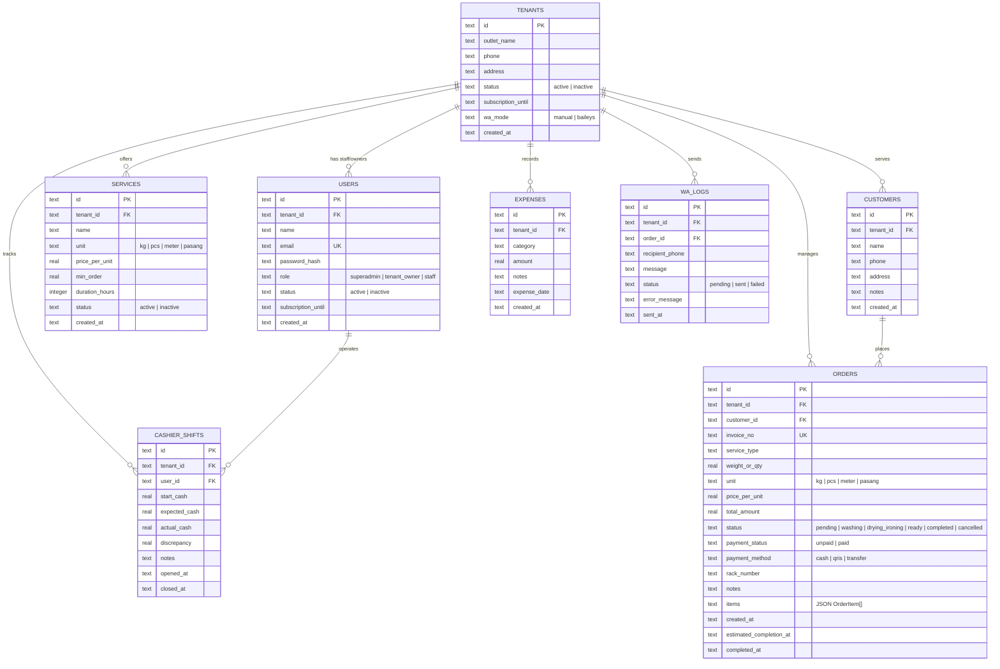

# Product Requirements Document (PRD)
# Orchid Brand Smart Laundry v2.0
## Sistem Manajemen Laundry Multi-Tenant Cloud & Kasir Operasional

- **Versi Dokumen:** 2.0.0
- **Status:** Active / In-Development
- **Target Release:** Q4 2026
- **Tech Stack:** Bun, Hono.js, Drizzle ORM, PostgreSQL, React 18, Vite, Tailwind CSS, Baileys WA, Docker
- **Penanggung Jawab:** Product & Engineering Team

---

## 1. Executive Summary & Problem Statement

### 1.1 Latar Belakang & Masalah Operasional
Bisnis laundry kiloan & satuan modern menghadapi serangkaian kendala operasional harian:
1. **Pakaian Tertukar / Salah Rak:** Di perumahan padat, pakaian antar tetangga rawan tertukar jika tidak ada penandaan nomor rak/keranjang yang jelas.
2. **Pelanggan Berulang Kali Menanyakan Status:** Pelanggan sering menelepon atau mengirim pesan menanyakan kapan cucian mereka selesai karena tidak adanya estimasi pengerjaan (SLA) dan sarana cek status mandiri.
3. **Notifikasi WhatsApp yang Mengganggu / Tidak Tepat Waktu:** Pengiriman notifikasi yang terlalu sering di setiap tahap justru membingungkan pelanggan; notifikasi yang paling bernilai adalah **saat cucian benar-benar selesai dan siap diambil**, lengkap dengan jam operasional toko.
4. **Selisih Uang Kasir (Cash Drawer Discrepancy):** Pergantian shift kasir tanpa pencatatan kas modal awal dan rekonsiliasi uang fisik rentan menimbulkan selisih kas.
5. **Kebocoran Akses Data (Multi-Tenant Isolation):** Pemilik franchise/cabang membutuhkan isolasi data absolut antar outlet dengan pembagian peran yang ketat antara Superadmin, Pemilik Outlet, dan Kasir Staff.

### 1.2 Solusi Produk (Product Vision)
**Orchid Brand Smart Laundry v2.0** adalah platform *SaaS Multi-Tenant Cloud* yang mengintegrasikan:
- **Kasir POS Cepat & Ramah Seluler:** Dukungan kalkulasi kiloan/satuan, nomor rak, cetak struk thermal 58mm/80mm ber-QR Code.
- **Engine Notifikasi WhatsApp Presisi:** WhatsApp **hanya terkirim secara otomatis saat status cucian Siap Diambil (`ready`)**, dilengkapi lokasi rak dan informasi jam operasional outlet.
- **Portal Publik Cek Resi Mandiri:** Pelanggan cukup memindai QR Code di struk kertas untuk memantau progres cucian secara real-time tanpa perlu login.
- **Pencatatan Finansial & Shift Kasir:** Buku kas otomatis (Uang Masuk Lunas vs Pengeluaran Toko), pembukuan laba bersih, ekspor CSV Excel, cetak laporan PDF resmi, dan rekonsiliasi shift kasir.

---

## 2. User Personas & Role-Based Access Control (RBAC)

| Peran (Role) | Target Pengguna | Tanggung Jawab & Hak Akses Utama |
|---|---|---|
| **Superadmin (HQ)** | Pemilik Franchise / Admin Pusat | • Memantau performa dan omset seluruh cabang.<br>• Mendaftarkan outlet (tenant) baru dan lisensi langganan.<br>• Akses switcher inspeksi seluruh cabang. |
| **Tenant Owner** | Pemilik Outlet Laundry | • Manajemen outlet, tarif layanan, dan pengaturan gateway WhatsApp.<br>• Mengelola akun kasir/staff di bawah cabangnya.<br>• Melihat laporan laba-rugi, piutang, dan buku kas cabang. |
| **Kasir / Staff** | Operator Pengerjaan & Kasir Toko | • Input order kasir, buka/tutup shift kasir, dan rekonsiliasi kas.<br>• Update status cucian (Pending ➔ Cuci ➔ Kering/Setrika ➔ Siap Diambil ➔ Selesai).<br>• Cetak struk thermal dan kirim nota digital. *(Dibatasi dari laporan laba bersih)* |
| **Customer (Publik)** | Pelanggan Laundry | • Menerima WA notifikasi otomatis saat cucian siap diambil.<br>• Scan QR struk fisik untuk cek resi mandiri di portal publik tanpa login. |

---

## 3. Fitur Utama & Kebutuhan Fungsional (Feature Specifications)

### EPIC 1: Autentikasi Terproteksi & Multi-User per Outlet
- **FR-1.1 (Enkripsi Kredensial):** Seluruh password pengguna wajib di-hash menggunakan algoritma standar industri (Bcrypt / Argon2id).
- **FR-1.2 (Token-Based Auth & Middleware):** Penerapan JWT / secure bearer token pada seluruh request API; backend Hono memvalidasi `tenantId` dan `role` langsung dari payload token untuk mencegah *broken object authorization*.
- **FR-1.3 (Dukungan Multi-Staff per Cabang):** Relasi fleksibel: 1 Tenant dapat memiliki 1 Pemilik (Tenant Owner) dan beberapa staf kasir (Staff) dengan hak akses yang terisolasi.
- **FR-1.4 (Shift Kasir & Rekonsiliasi Laci Kas):**
  - Kasir mencatat Kas Modal Awal saat membuka shift.
  - Saat tutup shift, sistem menghitung total penerimaan tunai dari order `paid (cash)` dan meminta kasir memasukkan jumlah uang fisik sebenarnya di laci (*cash count*).
  - Sistem mencatat apakah terjadi selisih kas (*discrepancy*).

### EPIC 2: POS Kasir, Master Layanan & Estimasi SLA
- **FR-2.1 (Master Layanan & Tarif Dinamis):**
  - Tabel master data `services` per tenant: Nama Layanan, Satuan (`kg`, `pcs`, `meter`, `pasang`), Tarif per Satuan, Minimum Order, dan Durasi Pengerjaan (jam).
  - Form order kasir memuat dropdown layanan dinamis yang otomatis mengisi tarif dan menghitung estimasi selesai.
- **FR-2.2 (Estimasi Selesai / SLA Tracking):**
  - Kalkulasi otomatis `estimatedCompletionAt = createdAt + durationHours`.
  - Dasbor kasir menampilkan badge penanda jika cucian belum berstatus `ready` mendekati atau melewati batas waktu pengerjaan (*Late SLA Warning*).
- **FR-2.3 (Pencatatan Multi-Item Transaksi):**
  - Kasir dapat memasukkan beberapa layanan sekaligus dalam satu nota (misal: Cuci Kiloan 4 kg + Bedcover 1 pcs).
- **FR-2.4 (Siklus 6 Tahap Status Cucian):**
  1. `pending`: Antrian cucian masuk
  2. `washing`: Sedang dalam proses mesin cuci
  3. `drying_ironing`: Pengeringan, setrika uap, dan pelipatan
  4. `ready`: **Selesai & Siap Diambil** (Notifikasi WhatsApp terkirim di tahap ini)
  5. `completed`: Selesai diambil oleh pelanggan
  6. `cancelled`: Dibatalkan (dikeluarkan dari omset aktif)
- **FR-2.5 (Nomor Rak / Keranjang Penyimpanan):** Input nomor rak (`rackNumber`) wajib atau sangat dianjurkan saat status diubah ke `ready` agar mempermudah pengambilan pakaian pelanggan.
- **FR-2.6 (Deteksi Cucian Menginap >3 Hari):** Filter otomatis dan badge penanda untuk cucian berstatus `ready` yang belum diambil lebih dari 3 hari.

### EPIC 3: Engine Notifikasi WhatsApp Cerdas & Baileys Gateway
- **FR-3.1 (Aturan Pengiriman Tunggal - HANYA Siap Diambil):**
  - Notifikasi otomatis WhatsApp **HANYA dikirimkan saat status cucian diubah menjadi `ready` (Siap Diambil)**.
  - Saat status diubah ke `process`, `completed`, `cancelled`, dll., sistem **TIDAK** mengirim pesan otomatis.
- **FR-3.2 (Pencantuman Informasi Jam Buka Outlet):**
  - Setiap pesan status siap diambil dan nota digital wajib mencantumkan jam operasional outlet:
    ```text
    ⏰ *Jam Buka Outlet:*
    • Senin - Jumat : 08.00 - 16.00
    • Sabtu : 08.00 - 13.00
    ```
- **FR-3.3 (Dukungan Mode Ganda):**
  - *Mode Baileys (Otomatis):* Scan QR akun WhatsApp outlet langsung di web, pesan terkirim via server.
  - *Mode Manual (wa.me):* Tautan langsung ke WhatsApp Web / aplikasi jika outlet memilih tidak menghubungkan session QR.
- **FR-3.4 (Riwayat Pengiriman / WA Logs):** Pencatatan status pengiriman pesan ke tabel `wa_logs` (`pending`, `sent`, `failed`) agar kasir dapat melihat riwayat pengiriman.

### EPIC 4: Portal Publik Cek Resi Mandiri (Self-Service Customer Tracking)
- **FR-4.1 (Halaman Cek Resi Publik):** Endpoint `/track/:invoiceNo` yang dapat diakses pelanggan tanpa login.
- **FR-4.2 (Scan QR Struk Thermal):** QR Code yang tercetak pada struk kasir thermal (58mm / 80mm) memuat tautan langsung ke halaman cek resi publik.
- **FR-4.3 (Informasi Pelacakan Publik):**
  - Progres pengerjaan cucian (Diterima ➔ Cuci ➔ Kering/Setrika ➔ Siap Diambil).
  - Status pembayaran (Lunas / Belum Lunas).
  - Lokasi nomor rak (hanya tampil jika sudah siap diambil).
  - Alamat cabang, nomor telepon, dan jam buka outlet.

### EPIC 5: Cetak Struk Kasir Thermal Authentic
- **FR-5.1:** Modal pratinjau struk bergaya kertas thermal fisik dengan pilihan ukuran **58mm** (Bluetooth saku) dan **80mm** (Desktop POS).
- **FR-5.2:** Layout cetak CSS `@media print` presisi tanpa header/footer default browser.
- **FR-5.3:** Tombol salin teks nota ke clipboard dan tombol kirim nota digital via WhatsApp.

### EPIC 6: Pembukuan Arus Kas & Laporan Finansial
- **FR-6.1 (Uang Masuk / Revenue):** Agregasi otomatis dari pesanan yang berstatus `paid`.
- **FR-6.2 (Piutang Kasir):** Akumulasi tagihan cucian selesai yang belum dibayar (`unpaid`).
- **FR-6.3 (Pengeluaran Operasional):** Form pencatatan uang keluar harian (listrik, air, gaji, sewa, servis mesin).
- **FR-6.4 (Laba Bersih / Net Profit):** Kalkulasi real-time: `Total Uang Masuk - Total Pengeluaran`.
- **FR-6.5 (Ekspor & Cetak Laporan):** Unduh file **CSV (UTF-8 BOM)** untuk Microsoft Excel dan cetak dokumen resmi **PDF** ber-kop surat outlet.

*(Catatan: Modul Manajemen Stok Bahan Baku / Chemical Inventory diparkir untuk rilis fase berikutnya).*

---

## 4. Skema Basis Data (Database Schema)



---

## 5. Spesifikasi REST API Endpoint

| Endpoint | Method | Role | Keterangan |
|---|---|---|---|
| `/api/auth/login` | POST | Publik | Login pengguna, verifikasi password ber-hash & lisensi langganan. |
| `/api/auth/logout` | POST | Authed | Invalidate token sesi pengguna. |
| `/api/auth/me` | GET | Authed | Profil pengguna yang sedang login & hak akses. |
| `/api/track/:invoiceNo` | GET | Publik | **Cek resi publik mandiri** tanpa autentikasi. |
| `/api/tenants` | GET / POST | Superadmin | Kelola seluruh cabang outlet. |
| `/api/services` | GET / POST | Owner | Kelola daftar paket layanan dan tarif per tenant. |
| `/api/services/:id` | PUT / DELETE | Owner | Ubah atau nonaktifkan paket layanan. |
| `/api/customers` | GET / POST | Staff/Owner | Direktori pelanggan dan pendaftaran inline baru. |
| `/api/orders` | GET / POST | Staff/Owner | Daftar transaksi dan pembuatan order kasir baru. |
| `/api/orders/:id` | PUT / DELETE | Staff/Owner | Koreksi rincian order kasir atau hapus permanen. |
| `/api/orders/:id/status` | PATCH | Staff/Owner | Ubah status pengerjaan (**Trigger WA hanya saat `ready`**). |
| `/api/orders/:id/payment` | PATCH | Staff/Owner | Pelunasan cepat kasir (Cash/QRIS/Transfer). |
| `/api/shifts/open` | POST | Staff/Owner | Buka shift kasir & catat modal kas awal. |
| `/api/shifts/close` | POST | Staff/Owner | Tutup shift kasir & rekonsiliasi uang fisik laci. |
| `/api/expenses` | GET / POST | Owner | Pencatatan pengeluaran operasional outlet. |
| `/api/stats/cashflow` | GET | Owner/Super | Agregat arus kas, piutang, dan laba bersih. |
| `/api/whatsapp/status` | GET | Owner | Status koneksi Baileys & nomor WA aktif. |
| `/api/whatsapp/connect` | POST | Owner | Request QR code koneksi Baileys. |
| `/api/whatsapp/disconnect`| POST | Owner | Logout sesi WhatsApp gateway. |
| `/api/whatsapp/mode` | PATCH | Owner | Ganti mode pengiriman (Otomatis Baileys vs Manual wa.me). |

---

## 6. Kebutuhan Non-Fungsional (NFR)

1. **Keamanan & Isolasi Data:**
   - Password wajib menggunakan enkripsi satu arah yang aman (*Bcrypt* dengan minimal 10 salt rounds).
   - Pengisolasian tenant di level middleware; seluruh query order/pelanggan di-filter ketat oleh `tenantId` token.
2. **Kinerja & Kecepatan:**
   - Waktu respons API rata-rata < 30ms didukung runtime Bun & Hono.js.
   - Waktu muat halaman tracking publik < 500ms untuk pengalaman cepat pengguna seluler di jaringan 4G.
3. **Keandalan WhatsApp Gateway:**
   - Session Baileys tersimpan persisten dalam disk volume terisolasi per tenant.
   - Auto-reconnect otomatis saat koneksi internet outlet pulih.
4. **Desain & Responsivitas:**
   - Antarmuka kasir optimal di perangkat layar sentuh tablet kasir maupun desktop monitor.
   - Format cetak struk thermal mendukung printer Bluetooth saku 58mm dan printer kasir meja 80mm.
