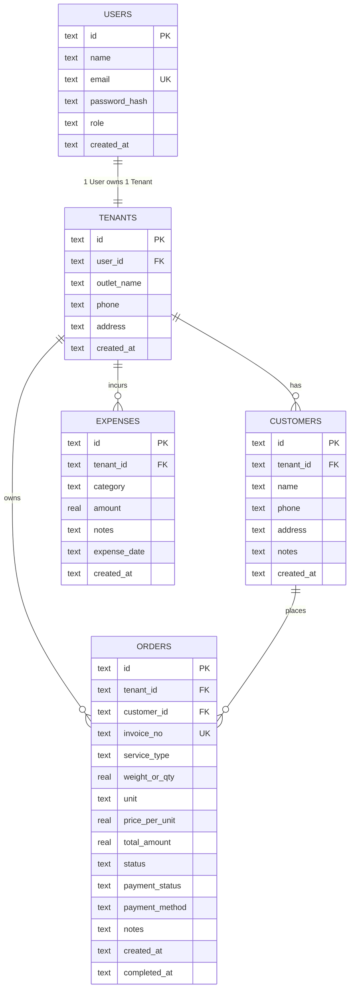

# Product Requirements Document (PRD)
# Orchid Brand Smart Laundry (Sistem Manajemen Laundry Multi-Tenant)

- **Versi Dokumen:** 1.0.0
- **Status:** Active / In-Development
- **Tech Stack:** Bun, Hono.js, Drizzle ORM, PostgreSQL, React 18, Vite, Tailwind CSS, Docker

---

## 1. Executive Summary & Visi Produk

**Orchid Brand Smart Laundry** adalah platform Multi-Tenant SaaS berbasis cloud untuk manajemen operasional dan keuangan bisnis laundry modern. Aplikasi ini dirancang untuk:
1. Memberikan kemudahan bagi **Superadmin Pusat** dalam memantau cabang/tenants di berbagai kota (Prinsip: 1 User = 1 Tenant Outlet).
2. Membantu **Pemilik Laundry (Tenant Owner) & Kasir** mencatat arus kas nyata secara online real-time:
   - **Uang Masuk (Income):** bersumber langsung dari transaksi order laundry (tunai, transfer, QRIS).
   - **Uang Keluar (Expenses):** pencatatan pengeluaran operasional (deterjen, pewangi, listrik, air, gaji, servis mesin, dsb).
3. Meningkatkan kepuasan pelanggan melalui **Notifikasi Otomatis WhatsApp** saat cucian selesai diproses dan siap diambil.

---

## 2. Arsitektur Monorepo & Teknologi

```
orchidbrand-smart-loundry/
├── .gitignore              # Monorepo ignore (node_modules, .env, dist)
├── package.json            # Root workspace config (`bun dev`)
├── docker-compose.yml      # Multi-container deployment (Postgres + Backend + Frontend)
├── PRD.md                  # Product Requirements Document
├── TODO.md                 # Roadmap & Status Pengerjaan
├── README.md               # Dokumentasi instalasi & panduan
├── backend/                # API Service (Bun + Hono + Drizzle ORM + PostgreSQL)
│   ├── src/
│   │   ├── index.ts        # Hono routing & business logic
│   │   └── db/
│   │       ├── index.ts    # Database client (PostgreSQL postgres-js)
│   │       ├── schema.ts   # Drizzle pg-core schema definition
│   │       └── seed.ts     # Initial demo data seeder
│   ├── Dockerfile
│   └── package.json
└── frontend/               # Single Page Application (React + Vite + Tailwind)
    ├── src/
    │   ├── App.tsx         # Dashboard Root Orchestrator
    │   ├── types/          # Shared TypeScript interfaces
    │   ├── components/     # Modular UI (Sidebar, Header, Tabs, Modals)
    │   └── main.tsx
    ├── Dockerfile
    └── package.json
```

### Stack Detail
| Layer | Komponen | Alasan Pemilihan |
|---|---|---|
| **Runtime & Package Manager** | Bun (v1.3+) | Eksekusi TypeScript native tanpa build step tambahan, startup instan (<10ms), konsumsi memori rendah. |
| **Backend Framework** | Hono.js (v4) | Framework web standar Web-Standards tercepat, tipe data aman (type-safe), native support Bun. |
| **ORM & Database** | Drizzle ORM + PostgreSQL (`postgres-js`) | Standar industri untuk SaaS Multi-Tenant Cloud. Handal menangani konkurensi multi-user, transaksi ACID, dan kompatibel dengan cloud hosting (Supabase, Neon, AWS RDS). |
| **Frontend Framework** | React 18 + Vite | Standar industri, reload super cepat, rendering interaktif. |
| **Styling & UI** | Tailwind CSS + Lucide Icons | Desain responsif, clean aesthetic, siap pakai untuk tampilan dashboard modern. |
| **Containerization** | Docker + Docker Compose | Standarisasi deployment production multi-platform (Linux/Windows/macOS). |

---

## 3. User Personas & Role

1. **Superadmin / Franchise Owner (Orchid Brand HQ)**
   - Memantau seluruh cabang tenant laundry yang terdaftar.
   - Melihat total omset agregat dan performa tiap tenant.
   - Menambahkan outlet dan user owner baru.

2. **Tenant Owner / Kasir Outlet**
   - Melakukan input pesanan laundry baru (Kg / Satuan).
   - Memperbarui status pengerjaan (Pending ➔ Cuci ➔ Kering/Setrika ➔ Siap Diambil ➔ Selesai).
   - Mengirim notifikasi WhatsApp otomatis ke nomor customer saat cucian siap.
   - Mencatat pengeluaran harian/mingguan toko (deterjen, plastik, listrik, air).
   - Melihat laporan laba/rugi bersih (Omset - Pengeluaran).

3. **Customer Laundry**
   - Menerima update status nota dan total tagihan via WhatsApp.

---

## 4. Fitur Utama & Kebutuhan Fungsional

### A. Manajemen Tenant & User (1 User : 1 Tenant)
- **FR-1.1:** Superadmin dapat melihat daftar seluruh tenant beserta owner, kontak, total order, dan total omset.
- **FR-1.2:** Superadmin dapat mendaftarkan tenant baru sekaligus akun login ownernya.
- **FR-1.3:** Setiap tenant memiliki data transaksi, customer, dan pengeluaran yang terisolasi secara logis (`tenantId`).

### B. Order Laundry & Pelacakan Status
- **FR-2.1:** Pembuatan order baru dengan kalkulasi harga otomatis berdasarkan berat (Kg) atau kuantitas (Pcs).
- **FR-2.2:** Penomoran nota otomatis berbasis format `INV-YYYYMM-XXX`.
- **FR-2.3:** Pelacakan 5 tahap status cucian:
  1. `pending` (Menunggu Diproses)
  2. `washing` (Sedang Dicuci)
  3. `drying_ironing` (Pengeringan & Setrika)
  4. `ready` (Selesai & Siap Diambil)
  5. `completed` (Sudah Diambil Pelanggan)
- **FR-2.4:** Manajemen status pembayaran: `unpaid` (Belum Lunas) vs `paid` (Lunas) dengan pilihan metode bayar (`cash`, `transfer`, `qris`).

### C. Notifikasi WhatsApp ke Customer
- **FR-3.1:** Sistem secara otomatis menghasilkan link WhatsApp direct (`wa.me/<phone>?text=...`) saat status berubah menjadi **Siap Diambil (`ready`)** atau **Selesai (`completed`)**.
- **FR-3.2:** Normalisasi nomor telepon otomatis (format internasional `628xxx` dari input lokal `08xxx`).
- **FR-3.3:** Template pesan mencakup: Nama Customer, Nama Outlet, No. Nota, Layanan, Berat/Qty, Status Pembayaran (Lunas / Tagihan), dan ucapan terima kasih.

### D. Pencatatan Keuangan (Arus Kas Masuk & Keluar)
- **FR-4.1 (Uang Masuk):** Agregasi otomatis dari seluruh order berstatus `paid`.
- **FR-4.2 (Piutang):** Pelacakan total uang yang belum dibayarkan customer (`unpaid`).
- **FR-4.3 (Uang Keluar):** Formulir pencatatan pengeluaran harian dengan kategori:
  - Deterjen & Pewangi
  - Listrik & Air
  - Gaji Karyawan
  - Servis Mesin
  - Plastik & Kemasan
  - Lain-lain
- **FR-4.4 (Laba Bersih / Net Profit):** Perhitungan dinamis `Total Uang Masuk Lunas - Total Pengeluaran`.

### E. Manajemen Data Pelanggan (Customer Directory)
- **FR-5.1:** Penyimpanan database pelanggan per tenant (Nama, Nomor WhatsApp, Alamat, Catatan Khusus).
- **FR-5.2:** Pemilihan cepat data pelanggan yang sudah ada saat membuat order baru.

---

## 5. Skema Basis Data (Data Model)



---

## 6. Spesifikasi REST API

| Endpoint | Method | Fungsi | Query/Body |
|---|---|---|---|
| `/api/health` | GET | Healthcheck backend & runtime Bun | - |
| `/api/tenants` | GET | List seluruh tenant + metrics omset | - |
| `/api/tenants` | POST | Pendaftaran tenant + owner baru | `{ ownerName, ownerEmail, outletName, phone, address }` |
| `/api/customers` | GET | List pelanggan per tenant | `?tenantId=...` |
| `/api/customers` | POST | Tambah data pelanggan | `{ tenantId, name, phone, address, notes }` |
| `/api/orders` | GET | List order per tenant | `?tenantId=...` |
| `/api/orders` | POST | Buat transaksi order baru | `{ tenantId, customerId, serviceType, weightOrQty, unit, pricePerUnit, totalAmount, ... }` |
| `/api/orders/:id/status` | PATCH | Ubah status order & generate WA payload | `{ status: "ready" \| "completed" ... }` |
| `/api/orders/:id/payment` | PATCH | Update status bayar & metode bayar | `{ paymentStatus: "paid", paymentMethod: "qris" }` |
| `/api/expenses` | GET | List pengeluaran per tenant | `?tenantId=...` |
| `/api/expenses` | POST | Input pengeluaran baru | `{ tenantId, category, amount, notes, expenseDate }` |
| `/api/expenses/:id` | DELETE | Hapus data pengeluaran | - |
| `/api/stats/cashflow` | GET | Ringkasan laba rugi & statistik order | `?tenantId=...` |

---

## 7. Kebutuhan Non-Fungsional (NFR)

1. **Kecepatan & Latensi:**
   - Respon API < 50ms untuk operasi CRUD lokal.
   - Vite hot-reload < 100ms.
2. **Kemudahan Menjalankan:**
   - Single command `bun dev` dari root repo untuk menjalankan fullstack secara bersamaan.
   - Support `docker compose up --build -d` untuk containerized deployment.
3. **Portabilitas Basis Data:**
   - Menggunakan SQLite file terstruktur di `backend/data/laundry.db` sehingga mudah di-backup dan di-restore.
4. **Isolasi Git:**
   - Semua artefak binary, file database, file environment secret, dan node_modules ter-ignore dengan benar di `.gitignore`.
