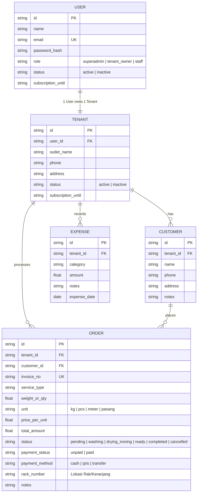

# Orchid Brand - Smart Laundry 🧺

Platform Multi-Tenant SaaS manajemen operasional dan keuangan bisnis laundry modern berbasis **Bun**, dibangun dengan arsitektur terpisah yang bersih: **Frontend (Vite + React)** dan **Backend API (Bun + Hono + Drizzle ORM PostgreSQL)**.

Dirancang untuk skala cloud multi-tenant (1 User = 1 Outlet Laundry), pencatatan arus kas lengkap (uang masuk dari order & uang keluar operasional), database pelanggan, serta notifikasi WhatsApp otomatis saat cucian siap diambil.

---

## 🛠️ Tech Stack Pilihan

| Layer | Teknologi | Peran |
| :--- | :--- | :--- |
| **Runtime & Toolchain** | **[Bun](https://bun.sh/)** | Package manager, bundler, dan runtime backend berkinerja tinggi. |
| **Backend API** | **[Hono](https://hono.dev/)** on Bun | Framework REST API ultra cepat, ringan, type-safe, dan modular. |
| **Database & ORM** | **PostgreSQL + [Drizzle ORM](https://orm.drizzle.team/)** | Database relational production-grade, handal untuk multi-tenant SaaS cloud, type-safe. |
| **Frontend Web** | **Vite + React (TypeScript)** | Single Page Application (SPA) responsif dan interaktif. |
| **Styling & UI** | **Tailwind CSS + Lucide Icons** | Desain antarmuka modern (Biru Tua, Biru Muda, Hitam, Putih). |
| **Customer Notification** | **WhatsApp Direct Link & API Gateway** | Kirim nota & pemberitahuan cucian selesai langsung ke nomor WhatsApp customer. |

---

## 🚀 Fitur Utama

### 1. Multi-Tenant Simpel (1 User = 1 Outlet)
- **Super Admin**:
  - Memantau semua User terdaftar.
  - Memantau semua Tenant (outlet laundry) beserta statistik ringkasnya.
- **Tenant Owner (Pemilik Outlet)**:
  - 1 User mengelola 1 Tenant/Outlet secara terisolasi.
  - Mengelola tarif layanan, operasional cucian, dan buku kas outlet sendiri.

### 2. Manajemen Order & Kasir Lengkap
- **Pencatatan Order Fleksibel & Cepat**:
  - Pilihan pelanggan terdaftar atau **+ Pelanggan Baru (Inline)** langsung dari modal pesanan tanpa perlu bolak-balik menu.
  - Dukungan layanan kiloan (Reguler/Express), satuan (Bedcover, Jas, Sepatu, Karpet), dan setrika.
  - **Nomor Rak / Keranjang Penyimpanan (`rackNumber`)**: Mencatat posisi rak cucian untuk mencegah pakaian tertukar antar tetangga.
- **Siklus Status Order**:
  - `Antrian (pending)` ➔ `Sedang Dicuci (washing)` ➔ `Pengeringan & Setrika (drying_ironing)` ➔ `Siap Diambil (ready)` ➔ `Selesai (completed)` serta dukungan pembatalan pesanan aman (`cancelled`).
- **Koreksi & Pembatalan Pesanan Kasir**:
  - Modal **Edit Pesanan** (`EditOrderModal`) untuk mengubah berat/qty, tarif, total harga, paket layanan, no. rak, dan catatan cucian.
  - Tombol **Batalkan Pesanan** dengan dialog konfirmasi aman (tidak dihitung dalam omset aktif).
  - Tombol **Hapus Pesanan Permanen** untuk pesanan yang batal atau salah input.
- **Pelunasan Cepat Kasir (Quick Pay)**:
  - Toggle 1-klik status bayar `Belum Lunas` ➔ `Lunas` dengan pilihan metode: **Tunai (Cash)**, **QRIS**, atau **Transfer Bank**.
- **Filter "Cucian Menginap" (>3 Hari Belum Diambil)**:
  - Indikator badge peringatan otomatis pada cucian yang sudah selesai diproses namun belum diambil pelanggan selama lebih dari 3 hari.

### 3. Cetak Struk Kasir Thermal & QR Code Nota
- **Thermal Receipt Printer**:
  - Pratinjau struk kasir bergaya kertas kasir thermal asli.
  - Pilihan lebar kertas standar: **58mm** (printer Bluetooth portabel) dan **80mm** (printer meja POS).
  - Cetak langsung via browser (`window.print()`) dengan CSS print layout presisi.
- **QR Code Invoice Dinamis**:
  - QR code otomatis di-generate di badan struk berbasis nomor nota pesanan.
- **Kirim Nota via WhatsApp 1-Klik**:
  - Tombol langsung di modal struk untuk mengirim nota digital lengkap ke WhatsApp pelanggan.

### 4. Notifikasi WhatsApp Cerdas & Kontekstual
- Sistem secara dinamis menghasilkan pesan WhatsApp sesuai kondisi terkini:
  - **Pesanan Diterima / Antrian:** Konfirmasi penerimaan cucian, nomor nota, rincian biaya & status bayar.
  - **Siap Diambil:** Notifikasi cucian selesai dan siap diambil, lengkap dengan **No. Rak / Keranjang**.
  - **Pengingat Cucian Menginap (>3 Hari):** Template ramah mengingatkan tetangga untuk segera mengambil pakaian.
  - **Selesai Diambil:** Ucapan terima kasih dan doa kepuasan pelanggan.
  - **Dibatalkan:** Informasi resmi pembatalan pesanan.
- **2 Pilihan Mode Pengiriman WhatsApp**:
  - **Otomatis via Baileys Gateway**: Scan QR WhatsApp outlet langsung di aplikasi. Server secara otomatis mengirim notifikasi saat status berubah menjadi Siap Diambil dan pengiriman nota digital 1-klik tanpa membuka tab browser.
  - **Manual Saja via wa.me**: Tanpa scan server, kasir cukup klik tombol WhatsApp untuk membuka WhatsApp Web/Desktop dengan format pesan siap kirim.

### 5. Pencatatan Keuangan, Arus Kas & Laporan Resmi
- **Uang Masuk (Income)**:
  - Otomatis terhitung dari order yang telah berstatus `Lunas` (mengabaikan order yang dibatalkan).
- **Piutang**:
  - Pelacakan akumulasi uang yang belum dibayarkan pelanggan (`unpaid`).
- **Uang Keluar (Expenses)**:
  - Form pencatatan biaya operasional toko (deterjen, pewangi, listrik, air PAM, gas, gaji karyawan, servis mesin).
- **Buku Kas & Ekspor Dokumen Resmi**:
  - Ringkasan omset, total biaya, dan laba bersih (*net profit*).
  - **Export CSV (Excel):** Buku kas terstruktur format UTF-8 BOM siap buka langsung di Microsoft Excel.
  - **Cetak Laporan PDF:** Dokumen laporan resmi ber-kop surat outlet dengan pilihan filter rentang tanggal (*Date Range Picker*).

---

## 📂 Struktur Direktori Proyek

```plaintext
orchidbrand-smart-loundry/
├── backend/                  # REST API Server (Bun + Hono + Drizzle + PostgreSQL)
│   ├── src/
│   │   ├── db/              # Schema Drizzle pg-core, koneksi & migration otomatis
│   │   ├── index.ts         # Server Hono, routing API & logic WhatsApp
│   │   └── seed.ts          # Seeder data demo saat startup
│   ├── Dockerfile
│   ├── package.json
│   └── tsconfig.json
│
├── frontend/                 # Client Web App (Vite + React 18 + TypeScript + Tailwind)
│   ├── src/
│   │   ├── components/      # UI Modular (Tabs, Modals, Layout, Common Table)
│   │   │   ├── tabs/        # Overview, Orders, Cashflow, Customers, Reports, Tenants, Users
│   │   │   ├── modals/      # CreateOrder, EditOrder, ReceiptModal, CreateExpense, dll.
│   │   │   └── common/      # ShadcnDataTable, Toast, Confirm, Icons
│   │   ├── types/           # Interface Order, Customer, Expense, Tenant, User
│   │   ├── App.tsx          # Root Orchestrator & State Handler
│   │   └── main.tsx
│   ├── Dockerfile
│   ├── nginx.conf
│   ├── package.json
│   ├── tailwind.config.js
│   └── vite.config.ts
│
├── docker-compose.yml        # Multi-container Postgres + Backend + Frontend
├── package.json              # Root Bun workspaces (`bun dev`)
├── PRD.md                    # Product Requirements Document
├── TODO.md                   # Roadmap & Status Fitur
└── README.md
```

---

## 🐳 Menjalankan dengan Docker (Paling Mudah)

### 1. Jalankan Seluruh Aplikasi (Backend + Frontend + Database)
Cukup jalankan satu perintah dari root direktori:
```bash
docker compose up --build -d
```

### 2. Akses Aplikasi
- **Frontend Web App**: [http://localhost:5173](http://localhost:5173)
- **Backend Hono API**: [http://localhost:5000/api/health](http://localhost:5000/api/health)

### 3. Perintah Docker Lainnya
```bash
# Melihat log container secara realtime
docker compose logs -f

# Menghentikan container
docker compose down
```

> **Catatan Persistensi Data**: Data PostgreSQL disimpan secara persisten di Docker volume `postgres_data`, sehingga data transaksi, order, dan customer tetap aman meskipun container dimatikan.
---

## 💻 Menjalankan Secara Lokal (Development)

Dengan konfigurasi Bun Monorepo Workspaces, Anda **cukup menjalankan 1 perintah dari root direktori** untuk menjalankan Backend API (port 5000) dan Frontend Web (port 5173) secara bersamaan:

```bash
# 1. Pastikan dependencies terpasang
bun install

# 2. Cukup 1 perintah untuk menjalankan backend + frontend sekaligus:
bun dev
```

Akses aplikasi di:
- **Frontend Dashboard:** [http://localhost:5173](http://localhost:5173)
- **Backend Health Check:** [http://localhost:5000/api/health](http://localhost:5000/api/health)

### Perintah Khusus Lainnya (Opsional)
```bash
# Menjalankan backend saja
bun run dev:backend

# Menjalankan frontend saja
bun run dev:frontend

# Push perubahan skema database Drizzle
bun run db:push
```

---

## 📑 Dokumentasi & Roadmap
- 📘 **[Product Requirements Document (PRD)](file:///c:/KAIRAV/project/orchidbrand-loundy/PRD.md)**: Arsitektur sistem, spesifikasi fitur lengkap, skema relasional, dan daftar endpoint API.
- 📋 **[TODO List & Roadmap](file:///c:/KAIRAV/project/orchidbrand-loundy/TODO.md)**: Status fitur yang sudah selesai dan daftar backlog yang belum dikerjakan berdasarkan prioritas (P0, P1, P2).

---

## 📋 Skema Data Utama (Data Models)



---

## 📄 Lisensi

ISC
