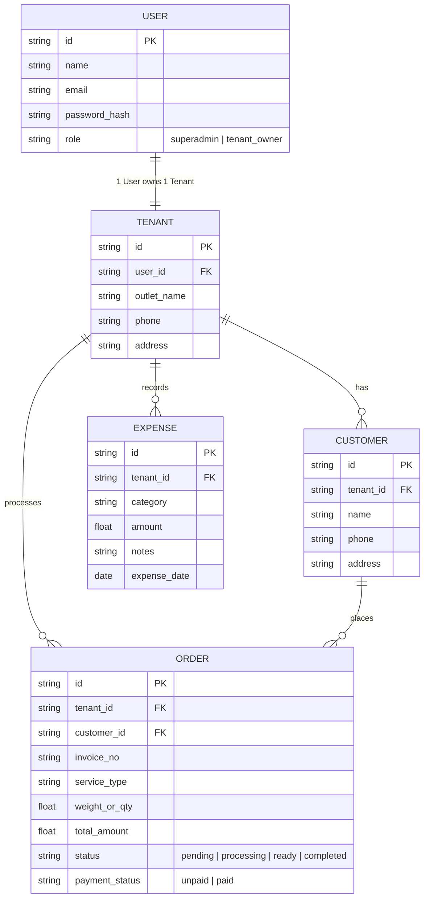

# Orchid Brand - Smart Laundry 🧺

Platform Multi-Tenant SaaS manajemen operasional dan keuangan bisnis laundry modern berbasis **Bun**, dibangun dengan arsitektur terpisah yang bersih: **Frontend (Vite + React)** dan **Backend API (Bun + Hono + Drizzle ORM PostgreSQL)**.

Dirancang untuk skala cloud multi-tenant (1 User = 1 Outlet Laundry), pencatatan arus kas lengkap (uang masuk dari order & uang keluar operasional), database pelanggan, serta notifikasi WhatsApp otomatis saat cucian siap diambil.

---

## 🛠️ Tech Stack Pilihan

| Layer | Teknologi | Peran |
| :--- | :--- | :--- |
| **Runtime & Toolchain** | **[Bun](https://bun.sh/)** | Package manager, bundler, dan runtime backend berkinerja tinggi. |
| **Backend API** | **[Hono](https://hono.dev/)** on Bun | Framework REST API ultra cepat, ringan, type-safe, dan modular. |
| **Database & ORM** | **PostgreSQL + [Drizzle ORM](https://orm.drizzle.team/)** | Database relational production-grade, handal untuk multi-tenant SaaS cloud, type-safe. |
| **Frontend Web** | **Vite + React (TypeScript)** | Single Page Application (SPA) responsif dan interaktif. |
| **Styling & UI** | **Tailwind CSS + Lucide Icons** | Desain antarmuka modern (Biru Tua, Biru Muda, Hitam, Putih). |
| **Customer Notification** | **WhatsApp Direct Link & API Gateway** | Kirim nota & pemberitahuan cucian selesai langsung ke nomor WhatsApp customer. |

---

## 🚀 Fitur Utama

### 1. Multi-Tenant Simpel (1 User = 1 Outlet)
- **Super Admin**:
  - Memantau semua User terdaftar.
  - Memantau semua Tenant (outlet laundry) beserta statistik ringkasnya.
- **Tenant Owner (Pemilik Outlet)**:
  - 1 User mengelola 1 Tenant/Outlet secara terisolasi.
  - Mengelola tarif layanan, operasional cucian, dan buku kas outlet sendiri.

### 2. Manajemen Order & Data Customer
- **Data Customer**:
  - Menyimpan profil pelanggan: Nama, Nomor Telepon/WhatsApp, dan Alamat.
  - Riwayat transaksi laundry per customer.
- **Siklus Status Order**:
  - `Antrian / Diterima` ➔ `Sedang Dicuci` ➔ `Proses Pengeringan/Setrika` ➔ `Selesai / Siap Diambil` ➔ `Sudah Diambil`.
- **Layanan & Tarif**:
  - Kiloan (Reguler / Express), Satuan (Bedcover, Jas, Sepatu, dll.), Setrika saja.
- **Status Pembayaran**:
  - `Lunas` (Cash / Transfer / QRIS) atau `Belum Lunas`.

### 3. Notifikasi WhatsApp Customer
- Saat order ditandai **Selesai / Siap Diambil**, sistem otomatis menyiapkan tombol notifikasi WhatsApp 1-klik (`wa.me`) dengan format pesan yang rapi:
  - Nomor Invoice / Nota.
  - Nama Customer & Ringkasan Cucian.
  - Total Biaya & Status Pembayaran (Lunas / Sisa Bayar).
  - Alamat & Kontak Outlet Laundry.
- Dapat dihubungkan ke WhatsApp Gateway (seperti Fonnte / Wablas) untuk pengiriman otomatis di latar belakang.

### 4. Pencatatan Keuangan & Arus Kas (Cashflow)
- **Uang Masuk (Income)**:
  - Otomatis tercatat saat order laundry dibayar/lunas.
- **Uang Keluar (Expenses)**:
  - Pencatatan pengeluaran operasional per kategori:
    - Bahan baku: Sabun deterjen, pewangi/softener, pemutih, plastik laundry.
    - Utilitas: Token listrik, air PAM, gas pengering.
    - Operasional: Gaji karyawan, sewa tempat, perawatan/servis mesin, dll.
- **Dashboard & Laporan Laba Bersih**:
  - Ringkasan pemasukan, pengeluaran, dan laba bersih (net profit) harian, mingguan, dan bulanan.

---

## 📂 Struktur Direktori Proyek

```plaintext
orchidbrand-smart-loundry/
├── backend/                  # REST API Server (Bun + Hono + Drizzle)
│   ├── src/
│   │   ├── db/              # Schema Drizzle & koneksi SQLite
│   │   ├── routes/          # Endpoint API (auth, tenant, order, customer, expense)
│   │   ├── middlewares/     # Auth JWT & validasi
│   │   └── index.ts         # Entry point server Hono
│   ├── data/                # File database SQLite (local)
│   ├── drizzle.config.ts
│   ├── package.json
│   └── tsconfig.json
│
├── frontend/                 # Client Web App (Vite + React + Tailwind)
│   ├── src/
│   │   ├── components/      # Komponen UI (Navbar, Card, Modal, Tabel)
│   │   ├── pages/           # Halaman (Dashboard, Order, Customer, Cashflow, Admin)
│   │   ├── services/        # Client API request (Hono client/fetch)
│   │   ├── App.tsx
│   │   └── main.tsx
│   ├── package.json
│   ├── tailwind.config.js
│   └── vite.config.ts
│
├── package.json              # Root workspace untuk menjalankan backend & frontend
└── README.md
```

---

## 🐳 Menjalankan dengan Docker (Paling Mudah)

### 1. Jalankan Seluruh Aplikasi (Backend + Frontend + Database)
Cukup jalankan satu perintah dari root direktori:
```bash
docker compose up --build -d
```

### 2. Akses Aplikasi
- **Frontend Web App**: [http://localhost:5173](http://localhost:5173)
- **Backend Hono API**: [http://localhost:5000/api/health](http://localhost:5000/api/health)

### 3. Perintah Docker Lainnya
```bash
# Melihat log container secara realtime
docker compose logs -f

# Menghentikan container
docker compose down
```

> **Catatan Persistensi Data**: Data PostgreSQL disimpan secara persisten di Docker volume `postgres_data`, sehingga data transaksi, order, dan customer tetap aman meskipun container dimatikan.
---

## 💻 Menjalankan Secara Lokal (Development)

Dengan konfigurasi Bun Monorepo Workspaces, Anda **cukup menjalankan 1 perintah dari root direktori** untuk menjalankan Backend API (port 5000) dan Frontend Web (port 5173) secara bersamaan:

```bash
# 1. Pastikan dependencies terpasang
bun install

# 2. Cukup 1 perintah untuk menjalankan backend + frontend sekaligus:
bun dev
```

Akses aplikasi di:
- **Frontend Dashboard:** [http://localhost:5173](http://localhost:5173)
- **Backend Health Check:** [http://localhost:5000/api/health](http://localhost:5000/api/health)

### Perintah Khusus Lainnya (Opsional)
```bash
# Menjalankan backend saja
bun run dev:backend

# Menjalankan frontend saja
bun run dev:frontend

# Push perubahan skema database Drizzle
bun run db:push
```

---

## 📑 Dokumentasi & Roadmap
- 📘 **[Product Requirements Document (PRD)](file:///c:/KAIRAV/project/orchidbrand-loundy/PRD.md)**: Arsitektur sistem, spesifikasi fitur lengkap, skema relasional, dan daftar endpoint API.
- 📋 **[TODO List & Roadmap](file:///c:/KAIRAV/project/orchidbrand-loundy/TODO.md)**: Status fitur yang sudah selesai dan daftar backlog yang belum dikerjakan berdasarkan prioritas (P0, P1, P2).

---

## 📋 Skema Data Utama (Data Models)



---

## 📄 Lisensi

ISC
