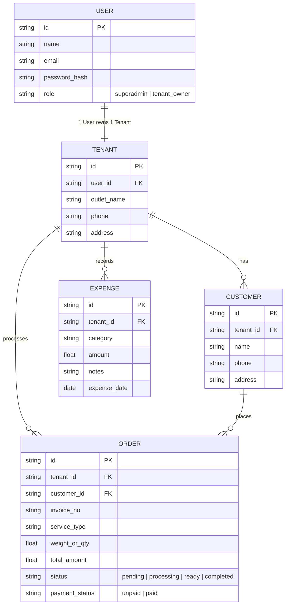

# Orchid Brand - Smart Laundry 🧺

Sistem manajemen operasional dan keuangan bisnis laundry modern berbasis **Bun**, dibangun dengan arsitektur terpisah yang bersih: **Frontend (Vite + React)** dan **Backend API (Bun + Hono + Drizzle ORM SQLite)**.

Dirancang untuk skala multi-tenant sederhana (1 User = 1 Outlet Laundry), pencatatan arus kas lengkap (uang masuk dari order & uang keluar operasional), database pelanggan, serta notifikasi WhatsApp otomatis saat cucian siap diambil.

---

## 🛠️ Tech Stack Pilihan

| Layer | Teknologi | Peran |
| :--- | :--- | :--- |
| **Runtime & Toolchain** | **[Bun](https://bun.sh/)** | Package manager, bundler, dan runtime backend berkinerja tinggi. |
| **Backend API** | **[Hono](https://hono.dev/)** on Bun | Framework REST API ultra cepat, ringan, type-safe, dan modular. |
| **Database & ORM** | **SQLite (`bun:sqlite`) + [Drizzle ORM](https://orm.drizzle.team/)** | Database file lokal zero-config, performa tinggi, dan schema type-safe. |
| **Frontend Web** | **Vite + React (TypeScript)** | Single Page Application (SPA) responsif dan interaktif. |
| **Styling & UI** | **Tailwind CSS + Lucide Icons** | Desain antarmuka modern, bersih, dan nyaman digunakan di mobile/desktop. |
| **Customer Notification** | **WhatsApp Direct Link & API Gateway** | Kirim nota & pemberitahuan cucian selesai langsung ke nomor WhatsApp customer. |

---

## 🚀 Fitur Utama

### 1. Multi-Tenant Simpel (1 User = 1 Outlet)
- **Super Admin**:
  - Memantau semua User terdaftar.
  - Memantau semua Tenant (outlet laundry) beserta statistik ringkasnya.
- **Tenant Owner (Pemilik Outlet)**:
  - 1 User mengelola 1 Tenant/Outlet secara terisolasi.
  - Mengelola tarif layanan, operasional cucian, dan buku kas outlet sendiri.

### 2. Manajemen Order & Data Customer
- **Data Customer**:
  - Menyimpan profil pelanggan: Nama, Nomor Telepon/WhatsApp, dan Alamat.
  - Riwayat transaksi laundry per customer.
- **Siklus Status Order**:
  - `Antrian / Diterima` ➔ `Sedang Dicuci` ➔ `Proses Pengeringan/Setrika` ➔ `Selesai / Siap Diambil` ➔ `Sudah Diambil`.
- **Layanan & Tarif**:
  - Kiloan (Reguler / Express), Satuan (Bedcover, Jas, Sepatu, dll.), Setrika saja.
- **Status Pembayaran**:
  - `Lunas` (Cash / Transfer / QRIS) atau `Belum Lunas`.

### 3. Notifikasi WhatsApp Customer
- Saat order ditandai **Selesai / Siap Diambil**, sistem otomatis menyiapkan tombol notifikasi WhatsApp 1-klik (`wa.me`) dengan format pesan yang rapi:
  - Nomor Invoice / Nota.
  - Nama Customer & Ringkasan Cucian.
  - Total Biaya & Status Pembayaran (Lunas / Sisa Bayar).
  - Alamat & Kontak Outlet Laundry.
- Dapat dihubungkan ke WhatsApp Gateway (seperti Fonnte / Wablas) untuk pengiriman otomatis di latar belakang.

### 4. Pencatatan Keuangan & Arus Kas (Cashflow)
- **Uang Masuk (Income)**:
  - Otomatis tercatat saat order laundry dibayar/lunas.
- **Uang Keluar (Expenses)**:
  - Pencatatan pengeluaran operasional per kategori:
    - Bahan baku: Sabun deterjen, pewangi/softener, pemutih, plastik laundry.
    - Utilitas: Token listrik, air PAM, gas pengering.
    - Operasional: Gaji karyawan, sewa tempat, perawatan/servis mesin, dll.
- **Dashboard & Laporan Laba Bersih**:
  - Ringkasan pemasukan, pengeluaran, dan laba bersih (net profit) harian, mingguan, dan bulanan.

---

## 📂 Struktur Direktori Proyek

```plaintext
orchidbrand-smart-loundry/
├── backend/                  # REST API Server (Bun + Hono + Drizzle)
│   ├── src/
│   │   ├── db/              # Schema Drizzle & koneksi SQLite
│   │   ├── routes/          # Endpoint API (auth, tenant, order, customer, expense)
│   │   ├── middlewares/     # Auth JWT & validasi
│   │   └── index.ts         # Entry point server Hono
│   ├── data/                # File database SQLite (local)
│   ├── drizzle.config.ts
│   ├── package.json
│   └── tsconfig.json
│
├── frontend/                 # Client Web App (Vite + React + Tailwind)
│   ├── src/
│   │   ├── components/      # Komponen UI (Navbar, Card, Modal, Tabel)
│   │   ├── pages/           # Halaman (Dashboard, Order, Customer, Cashflow, Admin)
│   │   ├── services/        # Client API request (Hono client/fetch)
│   │   ├── App.tsx
│   │   └── main.tsx
│   ├── package.json
│   ├── tailwind.config.js
│   └── vite.config.ts
│
├── package.json              # Root workspace untuk menjalankan backend & frontend
└── README.md
```

---

## 📦 Memulai Aplikasi (Getting Started)

### Prasyarat
- **Bun** (v1.1+ telah terpasang di sistem).

### 1. Instalasi Dependensi
Jalankan instalasi untuk seluruh workspace:
```bash
bun install
```

### 2. Konfigurasi Lingkungan (`.env`)

Di folder `backend/.env`:
```env
PORT=5000
JWT_SECRET=orchid_brand_secret_jwt_key_2026
DATABASE_URL=file:./data/laundry.db
```

Di folder `frontend/.env`:
```env
VITE_API_URL=http://localhost:5000/api
```

### 3. Migrasi / Inisiasi Database
```bash
cd backend
bun run db:push
```

### 4. Menjalankan Server & Client Bersamaan
Dari root folder:
```bash
bun run dev
```
- **Backend API**: `http://localhost:5000`
- **Frontend App**: `http://localhost:5173`

---

## 📋 Skema Data Utama (Data Models)



---

## 📄 Lisensi

ISC
